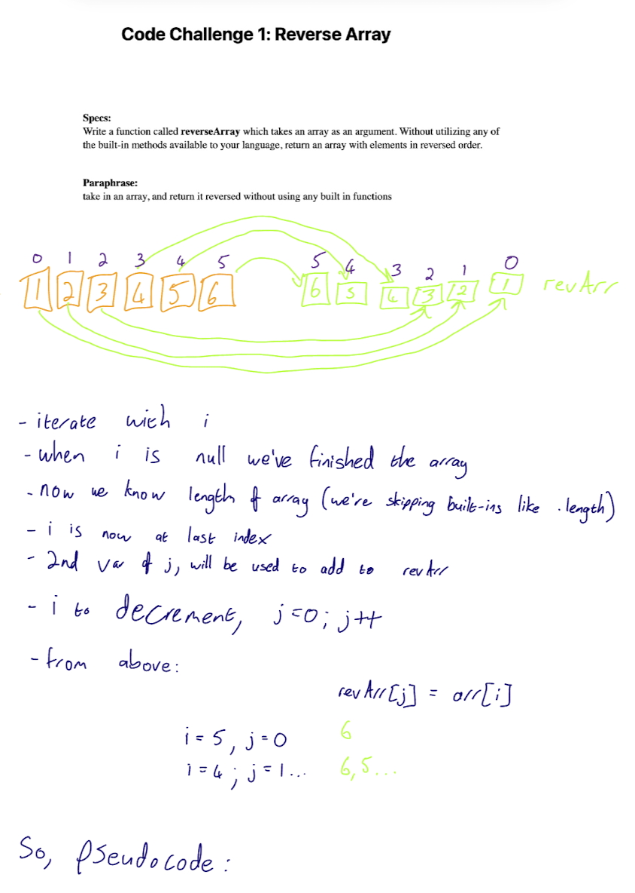
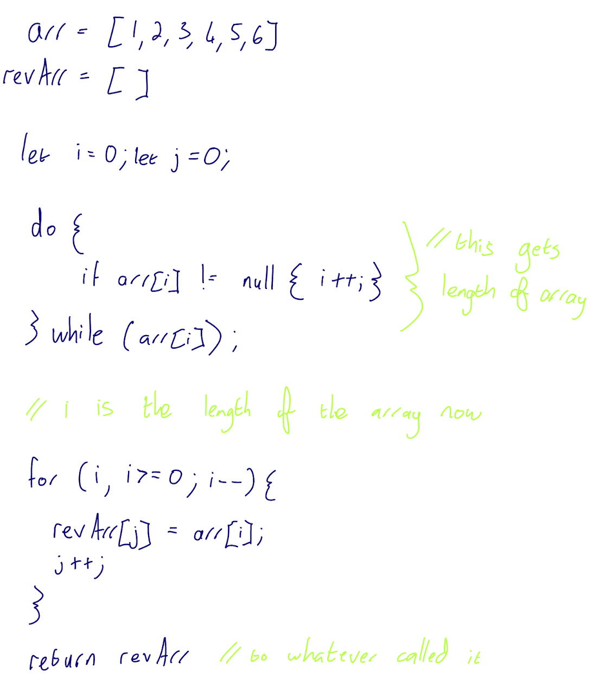

# Reverse an array.

Reverse an array such that the contents at the end is now at the beginning and vice versa.

## Whiteboard Process
- Notability ([direct link to image](https://notability.com/n/0OZm7qFi4EpdclH08EkBBu))
- Images



## Approach & Efficiency
<!-- What approach did you take? Why? What is the Big O space/time for this approach? -->
- I first paraphrased the question
- Then I sketched out what would need to happen
- Then I spoke about what needed to happen
- I noticed the spec said not to use built in functions, so I didn't assume we'd know the length of the array
- I wrote out long hand what the code needed to do
- I then wrote out the pseudo code

## Solution
- This is a no code lab I believe, so the pseudo-code is in the image


## Notes from lab work

### Specifications
Read all of the following instructions carefully.
Name things exactly as described.
Do all your work in a public repository called data-structures-and-algorithms.
Create a new branch in your repo called array-reverse.
Make a directory for this challenge, named according to your language’s conventions, containing a README.md file.
Update the “Table of Contents” - in the README at the root of the repository - with a link to this challenge’s README file.
NOTE: This challenge is whiteboard only
Write out code as part of your whiteboard process, but don’t worry about creating external program files.

### Feature Tasks
Write a function called reverseArray which takes an array as an argument. Without utilizing any of the built-in methods available to your language, return an array with elements in reversed order.

### Example
Input	Output
- `[1, 2, 3, 4, 5, 6]`	=> `[6, 5, 4, 3, 2, 1]`
- `[89, 2354, 3546, 23, 10, -923, 823, -12]` =>	`[-12, 823, -923, 10, 23, 3546, 2354, 89]`
- `[2, 3, 5, 7, 11, 13, 17, 19, 23, 29, 31, 37, 41, 43, 47, 53, 59, 61, 67, 71, 73, 79, 83, 89, 97, 101, 103, 107, 109, 113, 127, 131, 137, 139, 149, 151, 157, 163, 167, 173, 179, 181, 191, 193, 197, 199]` => `[199, 197, 193, 191, 181, 179, 173, 167, 163, 157, 151, 149, 139, 137, 131, 127, 113, 109, 107, 103, 101, 97, 89, 83, 79, 73, 71, 67, 61, 59, 53, 47, 43, 41, 37, 31, 29, 23, 19, 17, 13, 11, 7, 5, 3, 2]`

### Structure and Testing
Utilize the Single-responsibility principle: any methods you write should be clean, reusable, abstract component parts to the whole challenge. You will be given feedback and marked down if you attempt to define a large, complex algorithm in one function definition.

### Stretch Goal
Once you’ve achieved a working solution, implement the same feature with a different methodology. (Hint: what different techniques do you have when working with arrays? Recursion, loops, indexes, modifying the array input directly…)

In other words, use a different algorithm & pseudocode to solve the same problem. Then compare approaches for efficiency, readability, flexibility, etc.

### Submission Instructions
1. Work within the proper folder structure for your language, and as dictated by the challenge instructions.
2. Create a new README for this challenge, using the [README TEMPLATE](https://codefellows.github.io/common_curriculum/challenges/code/README-TEMPLATE) provided.
3. Embed an image of your completed whiteboard, matching the [example whiteboard layout](https://codefellows.github.io/common_curriculum/challenges/code/whiteboarding)
4. In addition to whiteboard drawing, optionally complete the code written on your whiteboard, along with a [proper suite of tests](https://codefellows.github.io/common_curriculum/challenges/code/testing)
  - Try giving your algorithm to a chatbot and see if it can produce working code and tests
5. Create a pull request from your branch to the main branch
6. In your open pull request, comment with the following checklist of tasks:
  - Check off the actual steps that you completed.
```text
 - [ ] Top-level README “Table of Contents” is updated
 - [ ] README for this challenge is complete
       - [ ] Summary, Description, Approach & Efficiency, Solution
       - [ ] Picture of whiteboard
       - [ ] Link to code
 - [ ] Feature tasks for this challenge are completed
 - [ ] Unit tests written and passing
       - [ ] “Happy Path” - Expected outcome
       - [ ] Expected failure
       - [ ] Edge Case (if applicable/obvious)
```
Submit your completed work:
Copy the link to your open pull request and paste it into the assignment submission field.
Leave a description of how long this assignment took you in the comments box.
Add any additional comments to your grader about your process or any difficulties you may have had with the assignment.
Merge your branch into main, and delete your branch (don’t worry, the PR link will still work).
Grading Rubric
Code challenge submissions may earn up to 5 points, composed from 3 factors:

Points	Metric
0-2	Effort
0-2	Working Solution
0-1	Process and Documentation
